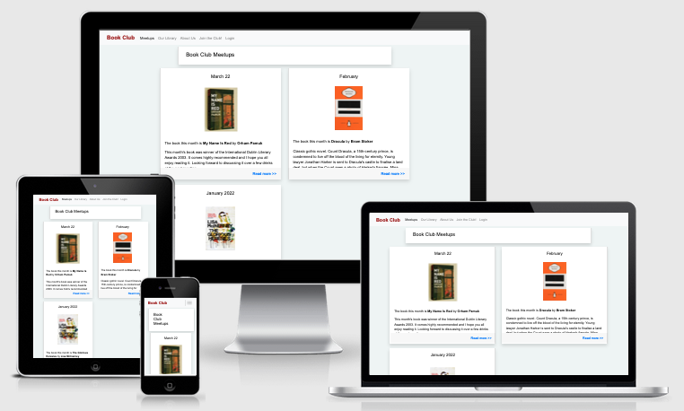
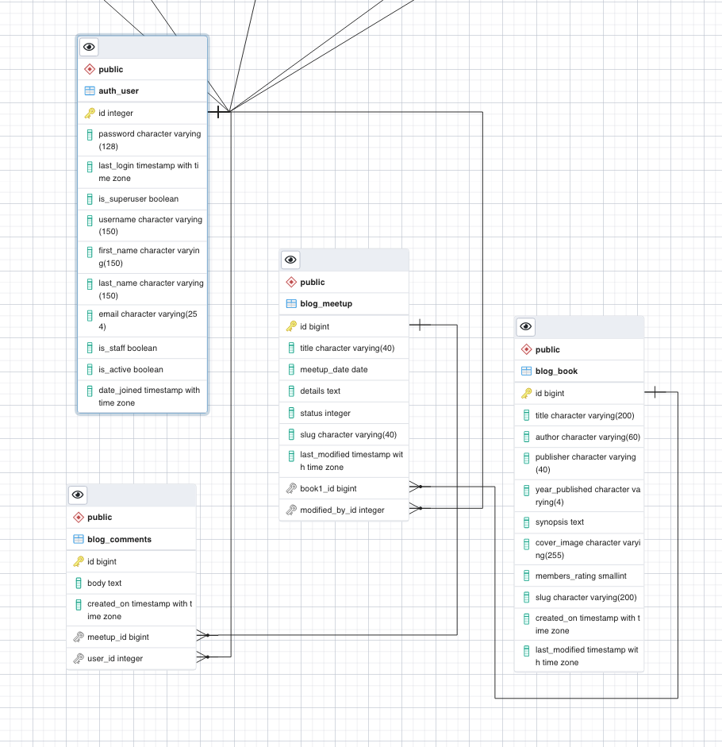

# The Bookclub Meetup Project

## An interactive social blog site for a Dubin Bookclub Meetup group.     

<br />

You can view the live deployed app [HERE.](https://bookclub-blog-ci-pp4.herokuapp.com/)
<br />

<!-- Responsive desgin sample image from http://ami.responsivedesign.is/ -->
<h2 align="center"></h2>

## - Table of Contents -
* [Purpose](#purpose)
* [User Experience Design (UX)](#user-experience-design)
* [Features](#features)
* [Technologies](#technologies)
* [Testing](#testing)
* [Deployment](#deployment)
* [Credits](#credits)

## - Purpose -
[This app was created as the fourth Portfolio Project (PP4) for the Code Institute's Full Stack Web Development course. The app is to showcase skills to design a web application using an MVC framework and related contemporary technologies, and as a requirement is deployed to Heroku.]    

An interactive social blog site for a Dubin Bookclub Meetup group.  The club meets once a month in a social setting to discuss the books assigned for reading through popular vote. 

Organisers can post details of the books to be read for the next meetup.  Members can leave comments on the books or the meeting and suggest new books for the group to read and dsicuss.  Members can also vote for which books will be on next months reading list from the list of suggested books.  Comments are only visibe to authenticated (logged-in) members.


## - User Experience Design -

- ### User stories

    - ### Design Strategy Goals
        - Create an interactive blog site for a Bookclub members' group Meetup
        - Site must be intuitive to read & navigate on both desktop & mobile devices - using Mobile First design
        - Site must allow admins (aka organisers) and users (aka members) to authenticate and interact with the content, e.g. create meetup info or post comments

    -   ### Design Scope to Deliver MVP
        - #### Club Organiser Goals
            As a site admin...
            - I want to to be able to setup and manage the book list
            - I want to be able to setup and manage the monthly meetup information page

        - #### First Time Visitor Goals
            As a first time user...
            - I want to be able to intuitively navigate the site
            - I want to easily find information about the book club and its social meetups
            - I want to be able to register to become a club member

        -   #### Returning Visitor Goals
            As a returning visitor...
            -   I want to be able to easily see details of the previous & next meetup  
            -   I want to be able to post comments about the meetup & books
            -   I want to be able to vote for book of the month


- ### Design
    -   #### Layout
        A simple blog site style layout is used. Logo and site navigation is visible along the top bar and a simple footer on the bottom of the viewport.  Content is displayed in Boostrap 'card' styled sections on the main page. 
         
    -   #### Content
       
    -   #### User Input
        Data is input or updated using Boostrap forms. All user interaction controls are either standard Bootstrap buttons or intuitive Fontawsome icons. 

    -   #### Typography
        The Google font Gill Sans was used for look of the Penguin Classic book covers, so I have chosen Google font Lato as it closely resembles that.


    -   #### Imagery
        No elaborate background image graphics are needed for this site.  Registered users are able to upload an image of a book cover to enhance the display.  It is the books that will draw the user's attention to the meetup information. In the absence of a user-uploaded image, a default placeholder image of an untitled Penguin Books 'Classic' cover is used. 
           
    
    -   #### Wireframes
        I did not create wireframes with software like Balsamiq, but I have decided to include pictures of my pencil sketches of my layout design process.  These do not necessarily represent the final look of the site pages, but are presented here to show how I went about fleshing out my initial thoughts and ideas about how to structure the site before a line of code was written.
        <h2 align="center"></h2>

    -   #### Database Entity Relationship Diagram
        <h2 align="center"></h2>


## - Features -  
To fulfil the needs of the site's users, the following features were implemented:

- **Simple navigation menu** is always visible at the top of the screen. The current page is indicated by the highlighted menu item.  The Login/Logout item indicates to the visitor if they are currently logged in.
- **Meetup cards** clearly announce the upcoming and past club events. Clicking anywhere in the card will take the user to the Meetup Details page.
- **Meetup Details page** displays much more information about the month's book and the organiser's message. 
- **Option to leave a comment** is available to logged-in members on the Meetup Detail page which allows members to engage in discussions with other club members, discuss the books, etc.  Member's have option to delete their own comments. Note that when users are not logged in the 'Leave a comment' option is replaced with a 'Login to join the discussion' call-to-action.
- **Cool Feature**  
- **Cool Feature**  
- 

## - Future Features -
- Allow members to rate books by clicking a visual '5-stars' control
- Automate closing the vote for next month's book and posting a message to the site
- Automate generating posting the next month's meetup based on the third Tuesday of each month
- Allow members to reply in-thread to individual comments to create conversations
- Allow members to post their own book reviews

<!--  -->
<!-- End Features -->
<!--  -->


## - Technologies Used -

### Languages Used

-   [Python 3.6+](https://en.wikipedia.org/wiki/Python_(programming_language)) with the [Django](https://en.wikipedia.org/wiki/Django_(web_framework)) web framework

### Frameworks, Libraries & Programs Used

1.  [Git](https://git-scm.com/) was used for version control and managed via the VSCode terminal to commit to Git and push to GitHub.
1.  [GitHub](https://github.com/) was used to store the project's code after being pushed from Git
1.  [Flake8](https://flake8.pycqa.org/en/latest/) linter extension for VScode 
1.  [Heroku](https://www.heroku.com) was used to deploy the app
1.  [LucidChart](https://lucidchart.com) was used to create the logic flowchart
1.  [Boostrap 4]() front-end CSS toolkit
1.  [Font Awesome 6]() font and icon toolkit
1.  [pgAdmin]() Postgres database GUI Tool used to generate the ERD 


<!---  --->
<!---  Begin testing section --->
<!---  --->

## Testing

All testing and code validation is documented [in this linked TESTING.md document](readme-docs/TESTING.md) located in the repo `readme-docs` folder.

## Bugs  

1. Github & LinkedIn fontawsome incons won't correctly apply css class style. https://github.com/twbs/bootstrap/issues/30343.  _reboot.scss:251
1. **FIXED** `navbar-toggler` / `navbar-collapse` button stopped working [ `templates/base.html` ]
    - Fix: Was initially using Bootstrap 5 property `data-bs-toggle` & `data-bs-target` but changed to use BS4 (for compatibility with `django-crispy-forms`).  Correct properties for BS4 are `data-toggle` & `data-target`
1. **FIXED** Bookcover image not being saved to book table for logged-in organiser.  Feature works when logged in as same user via `/admin` app interface.
    - Fix: `enctype="multipart/form-data"` must be a property of a `form` in order to upload an image field. Ref: [Binding uploaded files to a form](https://docs.djangoproject.com/en/3.2/ref/forms/api/#binding-uploaded-files-to-a-form)
<!---  --->
<!--- end of testing section --->
<!---  --->

## Deployment

### Requirements
- Python >=3.7, Django 3.2
- The following third party packages were installed using `pip install <package_name>` (listed below in order of installation).  The full list of required dependencies, with version numbers, is in the `requirements.txt` file.  
```
python-dotenv
Django
gunicorn
dj_database_url
psycopg2
dj3-cloudinary-storage
django-allauth
django-crispy-forms
```
- Heroku `Procfile` requires the following content
```
web: gunicorn bookclub.wsgi:application
```

### Heroku  
The live deployed site can be viewed on Heroku [HERE](https://bookclub-blog-ci-pp4.herokuapp.com)

The Project repository (repo) is at [https://github.com/davewatters/](https://github.com/davewatters/bookclub-ci-pp4)

Deployment of the site to Heroku was done as follows:
 
1.  Login to your Heroku account
1.  Create a New App
1.  (Important!) Select the 'Settings' tab first
1.  Select 'Add Buildpack' and select Python
1.  Add the database in the 'Resources' tab > Add-ons, select Heroku Postgres
1.  In 'Settings' click on 'Reveal Config Vars'
1.  Add any relevant config vars by entering the KEY/VALUE pair data, e.g. PORT & 8000. 
    The required vars are shown in the `.env_template` file in the project repo
1.  Select the 'Deploy' tab
1.  For the Deplyoment Method select GitHub
1.  Connect to GitHub repo by entering YOUR-REPO-NAME, then Connect
1.  A message will confirm that your app was successfuly deployed
1.  Test that the site has successfully gone live by clicking on the 'View' button
1.  Your app can now be accessed via any browser at: `https://YOUR-APP-NAME.herokuapp.com`


## - Credits - 

-   Inspired by The Dublin Book Club Meetup Group which used to meet monthly in a well known Dublin pub.  It was a great bunch of people who had lively debates and a laugh about all sorts of subjects - whether related the books or not.  Sadly, due to the Covid restrictions, it is no more.

### Code

- No code was directly copied to this project but numerous resources helped me understand what I needed and how best to code it. These include: [Mozilla MDN Web Docs](https://developer.mozilla.org/en-US/), the official [Python Docs](https://docs.python.org), official [Django Documentation](https://docs.djangoproject.com/en/3.2/), the [Bootstrap](https://developer.mozilla.org/en-US/) docs and code templates
- The usual suspects: StackOverflow.com, RealPython.com, etc.
- Book cover images used for testing and demo purposes were either photos of my own books on hand or screen grabs from book sellers' sites. I am not aware of any copyright infringement by doing this.

### Acknowledgements

-   My mentor [Daisy McGirr](https://github.com/Daisy-McG) for all her helpful feedback and knowledge.
-   The Code Institute community on Slack and the CI staff and students for their feedback and support.
