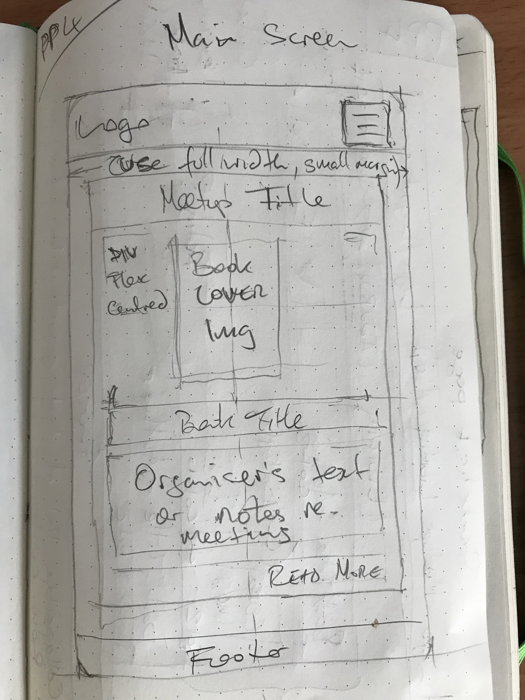

# The Bookclub Meetup Project

## An interactive social blog site for a Dubin Bookclub Meetup group.     

 

You can view the live deployed app [HERE.](https://ci-pp4-dw-bookclub.herokuapp.com/)
 

<!-- Responsive desgin sample image from http://ami.responsivedesign.is/ -->
<h2 align="center"></h2>

## - Table of Contents -
* [Purpose](#purpose)
* [User Experience Design (UX)](#user-experience-design)
* [Features](#features)
* [Technologies](#technologies)
* [Testing](#testing)
* [Deployment](#deployment)
* [Credits](#credits)

## - Purpose -
[This app was created as the fourth Portfolio Project (PP4) for the Code Institute's Full Stack Web Development course. The app is to showcase skills to design a web application using an MVC framework and related contemporary technologies, and as a requirement is deployed to Heroku.]    

An interactive social blog site for a Dubin Bookclub Meetup group.  The club meets once a month in a social setting to discuss the books assigned for reading through popular vote. 

Organisers can post details of the books to be read for the next meetup.  Members can leave comments on the books or the meeting and suggest new books for the group to read and dsicuss.  Members can also vote for which books will be on next months reading list from the list of suggested books.  Comments are only visibe to authenticated (logged-in) members unless they poster marks it as a public comment.  

## - User Experience Design -

- ### User stories

    - ### Design Strategy Goals
        - Create an interactive blog site for a Bookclub members' group Meetup
        - Site must be intuitive to read & navigate on both desktop & mobile devices - using Mobile First design
        - Site must allow admins (aka organisers) and users (aka members) to authenticate and interact with the content, e.g. create meetup info or post comments

    -   ### Design Scope to Deliver MVP
        - #### Club Organiser Goals
            As a site admin...
            - I wanto to be able to setup and manage the book list
            - I want to be able to setup and manage the monthly meetup information page

        - #### First Time Visitor Goals
            As a first time user...
            - I want to be able to intuitively navigate the site
            - I want to easily find information about the book club and its social meetups
            - I want to be able to register to become a club member

        -   #### Returning Visitor Goals
            As a returning visitor...
            -   I want to be able to easily see details of the previous & next meetup  
            -   I want to be able to post comments
            -   I want to be able to vote for book of the month

- ### Design
    -   #### Layout
         
    -   #### Content
       
    -   #### User Input
         
    -   #### Process/Logic Flow
        The basic menu-driven logic flow through the program is illustrated in the following flowchart..  
        <h2 align="center"></h2>  

    -   #### Typography
        The Google font..

    -   #### Imagery
           
    
    -   #### Wireframes
        I did not create wireframes with software like Balsamiq, but I have decided to include pictures of my pencil sketches of my layout design process.  These do not necessarily represent the final look of the site pages, but are presented here to show how I went about fleshing out my initial thoughts and ideas about how to structure the site before a line of code was written.
<h2 align="center"></h2>

## - Features -  
To fulfil the needs of the site's users, the following features were implemented:

- 

## - Future Features -
-    
<!--  -->
<!-- End Features -->
<!--  -->

## - Technologies Used -

### Languages Used

-   [Python 3.6+](https://en.wikipedia.org/wiki/Python_(programming_language))

### Frameworks, Libraries & Programs Used

1.  [Git](https://git-scm.com/) was used for version control and managed via the VSCode terminal to commit to Git and push to GitHub.
1.  [GitHub](https://github.com/) was used to store the project's code after being pushed from Git
1.  [Flake8](https://flake8.pycqa.org/en/latest/) linter extension for VScode 
1.  [Heroku](https://www.heroku.com) was used to deploy the app
1.  [LucidChart](https://lucidchart.com) was used to create the logic flowchart
1.  [Boostrap 5]() front-end CSS toolkit
1.  [Font Awesome 6]() font and icon toolkit

<!---  --->
<!---  Begin testing section --->
<!---  --->

## - Testing -
### UX Goals, User Stories

-   #### As a first time user...
    -  I want to be able to intuitively navigate the site
       
    -  I want to easily find instructions to understand how to use the site
        
    -  I want to be able to 
    -  I want the site to be visually clear & appealing  
       

-   #### As a returning visitor...
    -   I want to be able to 
    -   I want to be able to view 

-   #### As a frequent user...
    -   I want to to be able to increase the difficulty level of the game to make play more exciting  
        

 
### Code Validation
-   The [PEP8 Online](http://pep8online.com) linter was used to ensure the code adhered to the Python Style Guidelines.
<h2 align="center"></h2>

-   **https://pythex.org** was used to test both regular expressions used in the program: `email_regex` and `html_regex`.  I tested that `check_email()` correctly identifies email addresses with, for example, spaces in the domain name, or a typo like a comma in place of the 'dot'. For the regex used in `strip_html()` I checked some sample descriptions from the breach info.

### Bugs  

1. No known bugs at this time
<!---  --->
<!--- end of testing section --->
<!---  --->

## - Deployment -

### Heroku  
The live deployed site can be viewed on Heroku [HERE](https://ci-pp4-dw-bookclub.herokuapp.com)

The Project repository (repo) is at [https://github.com/davewatters/pwnytrap-ci-pp3](https://github.com/davewatters/)

Deployment of the site to Heroku was done as follows:
 
1.  Login to your Heroku account
1.  Create a New App
1.  (Important!) Select the 'Settings' tab first
1.  Click on 'Reveal Config Vars'
1.  Add any relevant config vars by entering the KEY/VALUE pair data, e.g. PORT & 8000
1.  Select 'Add Buildpack'
1.  (Important!) Select Python first, then select NodeJS
1.  Select the 'Deploy' tab
1.  For the Deplyoment Method select GitHub
1.  Connect to GitHub repo by entering YOUR-REPO-NAME, then Connect
1.  A message will confirm that your app was successfuly deployed
1.  Test that the site has successfully gone live by clicking on the 'View' button
1.  Your app can now be accessed via any browser at: `https://YOUR-APP-NAME.heroku.com`

## - Credits - 

-   

### Code

-   No code was directly copied to this project but numerous resources helped me understand what I needed and how best to code it. These include: The official [Python Docs](https://docs.python.org), StackOverflow.com, W3Schools.com, RealPython.com  
-   _Automate the Boring Stuff with Python, 2nd Edition_, Al Sweigart. Very helpful as an intro to implementing regex searching in Python and also working with the `requests` and `json` modules
-   https://www.regular-expressions.info/email.html
- 

### Acknowledgements

-   My mentor [Daisy McGirr](https://github.com/Daisy-McG) for all her helpful feedback and knowledge.
-   The Code Institute community on Slack and the CI staff and students for their feedback and support.
