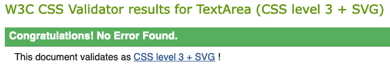
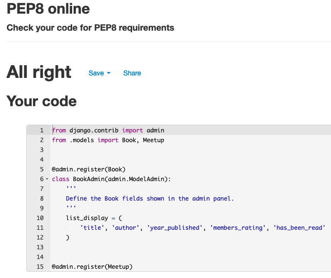
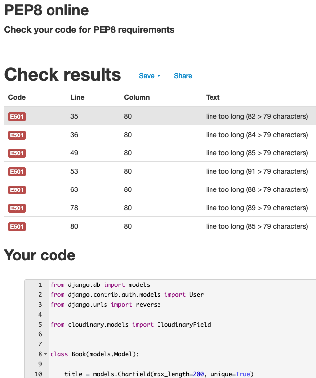

# Testing - The Bookclub Meetup Project

### [ Return to the project [README document](../README.md#testing) ]

## - Table of Contents -
* [Manual Testing](#manual-testing)
* [Automated Testing](#automated-testing)
* [Code Validation](#code-validation)

## Manual Testing

### UX Goals, User Stories

- #### As a Site Admin / Club Organiser..
    - I want to to be able to setup and manage the book list
        - I tested that I could log into the admin panel and have ability to create, read, update or delete (CRUD) a book.  I tested that I could also do this via the main menu login.
    - I want to be able to setup and manage the monthly meetup information page
        - I tested that I could log into the admin panel and have full CRUD ability for a meetup.  I tested that I could also do this via the main menu option.

- #### As a first time user...  
    -  I want to be able to intuitively navigate the site
        - All menu options were tested to ensure that they opened the correct functionality.  The navigation bar remains at the top of the screen so that the user can easily move between options.

    - I want to easily find information about the book club and its social meetups
        - I tested that I could click through the meetup information cards on the main screen to reveal full details about the meetup & this month's book.  I tested that the About page displays the club information.

    -  I want to be able to Sign Up as a member of the site
       - I tested that I could create a new registered user from the login screen.

- #### As a returning visitor...
    -   I want to be able to easily see details of the previous & next meetup
        - I tested that all of the meetups are clearly visible on the main screen and scrolling down reveals older dates. 

    -   I want to be able to post comments about the meetup & books
        - I tested that when I was logged in as a member I had the option to post comments on a meetup page. 

### Further Testing

- #### As a Site Admin
    - I want to ensure that site visitors who are unauthenticated cannot access any admin functionality other then viewing site content
        - I tested that unauthenticated visitors get redirected to the sign in page if attempting to access `/meetups/new`, for example
    - I want to ensure site visitors can't access member pages or functionality
        - I tested to options to add/edit/delete etc. were not visible to users when not logged in
        - I tested that attempting to access `/meetups/new` or `/books/new` redirects to a '403 - Forbidden' error message and allows the user to link back to the main page.
    - I want to ensure that site members can not delete posts created by other members
        - I tested that attempting to access (for example) `/comments/8/delete`, which was created by a different user, redirects to a '403 - Forbidden' error message and allows the user to link back to the main page.
    - I want to ensure that site visitors or members can not delete meetups
        - I tested that attempting to access (for example) `/meetups/4/delete`, which is only allowed by organisers, redirects to a '403 - Forbidden' error message and allows the user to link back to the main page.
    - I want the site to be fully responsive on different screen sizes
        - I tested that content resized properly and that the information was clearly readable and accesible on all screen sizes.

## Automated Testing
Automated testing was not used for this project.

## Code Validation

The [W3C Markup Validator](https://validator.w3.org/#validate_by_uri), [W3C CSS Jigsaw Validator](https://jigsaw.w3.org/css-validator/#validate_by_uri) and the [JSHint JavaScript Code Quality Tool](https://jshint.com) were used to validate every page of the project for syntax errors. **NOTE: All validation was re-run after fixing any errors shown below to ensure that no further errors or warnings existed.**

### HTML
<h2 align="center"></h2>
<!-- <h2 align="center"></h2> -->

### CSS
<h2 align="center"></h2>

### JavaScript
In the end, JavaScript use was minimal. JSHint returned no errors.

<!-- <h2 align="center"></h2> -->

### Python PEP8
The [PEP8 Online](http://pep8online.com) linter was used to ensure the code adhered to the Python Style Guidelines. However, as this is a Django project an exception to PEP8 was made for line lengths greater than 79.  Where lines were in or around 88 characters long, and no better readability could be achieved by shortening them, they were left as is. See the following doc about coding style: [Django Coding Style](https://docs.djangoproject.com/en/dev/internals/contributing/writing-code/coding-style/#python-style)

- **`admin.py`**
<h2 align="center"></h2>

- **`forms.py`**
<h2 align="center"></h2>

- **`models.py`** - showing an example of lines which exceed the PEP8 recommended 79. Django Project recommends 88.  
<h2 align="center"></h2>

- **`views.py`** - showing an example of lines which exceed the PEP8 recommended 79. Django Project recommends 88.  
<h2 align="center"></h2>

### [ [Click here to return to the project README document](../README.md#testing) ]
